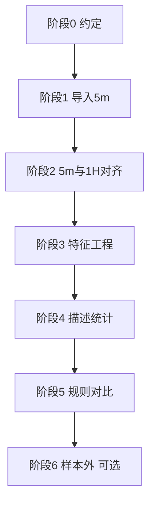

# 1H 小时内 5m 微观结构分析 — 实施计划

## 1. 背景与目标

### 1.1 问题

当前预测框架：**第 t 根 1H 收盘后**，用第 t 根特征预测 **第 t+1 根 1H** 开→收方向（`next_bar_up`）。

单根 1H K 线只能看到整小时的 OHLC、实体、影线，**看不到这一小时内部价格是怎么走出来的**。  
若把第 t 根 1H 拆成 **12 根 5m**，可分析小时内的路径、节奏、收盘动能等，寻找对第 t+1 根方向的额外信息。

### 1.2 目标

| 层级 | 目标 |
|------|------|
| 数据 | v2 内有一份 **OHLC 正确** 的 `BTCUSDT_5m.parquet`，与现有 `BTCUSDT_1h.parquet` 时间对齐 |
| 特征 | 每根 1H 附带「小时内 5m 聚合特征」 |
| 分析 | 描述性分桶 + 规则对比（与 `prediction_1h.py` 同一评估口径） |
| 产出 | 可复现脚本、特征缓存、分析报告 |

### 1.3 非目标（本阶段不做）

- 不修改现有 `prediction_1h.py` 默认行为（t → t+1）
- 不使用 `bnb-quant` 旧项目里未校验的 5m 数据
- 不做实盘、不做手续费回测（仅方向准确率）

---

## 2. 时间线与数据关系

```
第 t 根 1H  [open_time = T, 收盘时刻 T+1h)
    ├── 5m[0]  T + 0min
    ├── 5m[1]  T + 5min
    ├── ...
    └── 5m[11] T + 55min

信号时点：第 t 根 1H 收盘（与现框架一致）
预测目标：第 t+1 根 1H 的 close > open
```

- 所有 `open_time` 使用 **UTC**（与 Gate 导入一致）
- 完整 1H 桶内应有 **12 根** 5m；不足 12 根标记为不完整，分析时可过滤

---

## 3. 分步实施计划

### 阶段 0：环境与约定（0.5 天）

**任务**

- [ ] 确认 Gate 5m CSV 源目录：`~/Downloads/5mdata`（`BTC_USDT-YYYYMM.csv.gz`）
- [ ] 确认 5m 文件命名规则（`BTC_USDT-YYYYMM.csv.gz` 等），必要时扩展 `discover_gate_files`
- [ ] 在 `README.md` 中补充 5m 导入说明（一行链接到本文档）

**验收**

- `import_gate.py --dry-run --interval 5m` 能列出待导入文件

---

### 阶段 1：导入 5m 数据（1 天）✅ 已完成

**任务**

- [x] 使用现有 `import_gate_directory` + 正确列顺序 `timestamp, volume, close, high, low, open`
- [x] 输出：`data/klines/BTCUSDT_5m.parquet`
- [x] 导入后运行质量审计

**实际结果（2026-06-25）**

| 项 | 值 |
|----|-----|
| 源目录 | `~/Downloads/5mdata`（41 个月度文件） |
| 行数 | **359,124** 根 5m |
| 时间范围 | 2023-01-01 ~ 2026-05-31 |
| artifact | **51.0%**（OHLC 正常） |
| ohlc_violations | 0 |
| gaps | 5（可接受） |
| 与 1h 重叠 | 2023-01-01 ~ 2026-05-31 |

**命令（拟定）**

```bash
cd bnb-quant-v2
PYTHONPATH=src python scripts/import_gate.py \
  --dir ~/Downloads/5mdata \
  --symbol BTCUSDT \
  --interval 5m
```

**质量门禁（`audit_klines`，`bar_hours=5/60` 或新增 `bar_minutes=5`）**

| 检查项 | 期望 |
|--------|------|
| `artifact`（open/close 反了） | < 10%（正常约 50%  fwd_up\|yin） |
| `close[t+1]==open[t]` | 接近 0%（5m 连续） |
| `ohlc_violations` | 0 |
| `duplicate_times` | 0 |
| 时间范围 | 与 1h 数据有大量重叠（至少 2023+） |

**交付物**

- `BTCUSDT_5m.parquet`
- 终端质量报告截图或日志

**风险**

- 旧 `bnb-quant/data/klines/BTCUSDT_5m.parquet` **不可直接使用**（曾发现 OHLC 列序错误）

---

### 阶段 2：5m 与 1H 对齐匹配（1 天）✅ 已完成

**任务**

- [x] 新增模块 `src/bnb_quant_v2/analysis/intra_5m.py`
- [x] 实现 5m → 1H 桶映射：`hour_bucket = open_time.floor("1h")`
- [x] 实现 **聚合一致性校验**：用 12 根 5m 重算 OHLC，与对应 1H 行对比
- [x] 输出对齐报告

**实际结果（2026-06-25，BTCUSDT）**

| 项 | 值 |
|----|-----|
| 1H 总数 | 29,928 |
| 有 5m 聚合 | 100.00% |
| 完整 12 根 5m | **99.98%**（29,923 / 29,928） |
| OHLC 全匹配 | **100.00%** |
| volume 匹配 | 100.00% |
| 不完整小时 | 5 个（交易所维护/缺 bar，OHLC 仍一致） |
| 分析用样本 | 过滤后 **29,923** 根（`m5_count==12`，`align_5m_to_1h(complete_only=True)` 默认） |

**命令**

```bash
PYTHONPATH=src python scripts/validate_intra_alignment.py
```

**核心逻辑（伪代码）**

```python
df_5m["hour_bucket"] = df_5m["open_time"].dt.floor("1h")

def agg_one_hour(g):
    return pd.Series({
        "m5_count": len(g),
        "m5_open": g["open"].iloc[0],
        "m5_close": g["close"].iloc[-1],
        "m5_high": g["high"].max(),
        "m5_low": g["low"].min(),
        "m5_volume": g["volume"].sum(),
    })

intra = df_5m.groupby("hour_bucket").apply(agg_one_hour)
merged = df_1h.merge(intra, left_on="open_time", right_index=True)
```

**交付物**

- `intra_5m.py`：`aggregate_5m_to_1h()`、`align_5m_to_1h()`、`validate_hour_alignment()`
- `scripts/validate_intra_alignment.py`

**验收** ✅

- 完整 1H 桶对齐通过率 > 99%（实际 99.98%）
- OHLC 一致率 100%

---

### 阶段 3：小时内 5m 特征工程（1–2 天）✅ 已完成

**任务**

- [x] 在 `intra_5m.py` 实现 `compute_intra_features(group_5m) -> dict`
- [x] 实现 `enrich_1h_with_intra(df_1h, df_5m) -> DataFrame`
- [x] 缓存 `data/analysis/BTCUSDT_1h_intra5m_features.parquet`

**实际结果**

| 项 | 值 |
|----|-----|
| 样本 | 29,923 根（已过滤 5 个不完整小时） |
| 特征列 | 46 列（1H 形态 + 15 个 m5 特征 + 标签） |
| 构建命令 | `PYTHONPATH=src python scripts/build_intra_5m_features.py` |

**初步发现（描述性）**

- 最后 3 根 5m 皆阴（`阴阴阴`）→ 下一根涨 **55.8%**（n=3,645）
- 皆阳（`阳阳阳`）→ 下一根涨 **48.9%**（偏弱）

**第一批特征（建议先做）**

| 字段 | 说明 |
|------|------|
| `m5_count` | 桶内 5m 根数（期望 12） |
| `m5_yang_cnt` | 阳线根数 |
| `m5_yin_cnt` | 阴线根数 |
| `m5_ret_sum` | 各 5m `(close-open)/open` 之和 |
| `m5_first_half_ret` | 前 6 根收益之和 |
| `m5_second_half_ret` | 后 6 根收益之和 |
| `m5_last1_yang` | 最后 1 根是否阳 |
| `m5_last2_yang` | 最后 2 根是否皆阳 |
| `m5_last3_yang_cnt` | 最后 3 根阳线数 |
| `m5_high_idx` | 最高价出现在第几根（0–11） |
| `m5_low_idx` | 最低价出现在第几根 |
| `m5_close_strength` | 1H 收盘在振幅中的位置 `(close-low)/(high-low)` |
| `m5_recovery` | 自小时内最低点至收盘的反弹幅度 |
| `m5_vol_first_half_ratio` | 前半成交量 / 全小时成交量 |
| `m5_pattern_last3` | 最后 3 根阴阳编码（如 `阴阳阳`） |

**与现有 1H 特征合并**

- 复用 `enrich_bar_features()` 得到 `body_pct`、`candle_type` 等
- 合并后增加 `next_bar_up` 作为标签

**交付物**

- 特征表 parquet（可选）
- 单元测试：合成 12 根 5m 聚合结果可预期

---

### 阶段 4：描述性统计（1 天）✅ 已完成

**任务**

- [x] 新增 `prediction_intra.py` → `compare_intra_descriptive()`
- [x] 按特征分桶统计 **下一根 1H 收涨率**
- [x] CLI：`scripts/analyze_intra_5m.py`
- [x] CSV：`data/analysis/intra5m_descriptive.csv`

**命令**

```bash
PYTHONPATH=src python scripts/analyze_intra_5m.py
```

**主要发现（29,923 根，基准 50.78%）**

| 维度 | 强信号 |
|------|--------|
| 尾盘 `阴阴阴` | 55.8%（n=3,645） |
| 1H大阴线 & 后半段未反弹 | **57.4%**（n=3,856） |
| 1H大阴线 | 56.9% |
| 后半段 5m 跌 | 55.1% |
| 收盘偏弱（close_strength 0-33%） | 55.3% |
| 最低价在后半 | 53.7% |
| 后半段 5m 涨 | **46.2%**（偏跌） |

---

### 阶段 4b：p1 × f6 → 当前 1H（:30 信号）

**与阶段 4 分离，勿混用**

| 项 | 阶段 4 (`t-next`) | 阶段 4b (`p1-f6`) |
|----|-------------------|-------------------|
| 5m 数据 | 第 t 根内 **12 根** | 第 t-1 根 12 根 + 第 t 根 **前 6 根** |
| 预测目标 | 第 **t+1** 根 1H (`next_bar_up`) | 第 t 根 **后30分钟** (`half2_up`) |
| 信号时点 | 第 t 根 1H 收盘 | 第 t 根 **:30**（第 6 根 5m 收盘） |
| 入场/出场 | — | entry=f6末close, exit=1H close |

**代码**

| 模块 | 职责 |
|------|------|
| `intra_5m.py` | `compute_first6_features`, `compute_half2_features`, `enrich_p1_f6` |
| `prediction_p1_f6.py` | `compare_p1_f6_descriptive`（目标 half2_up） |
| `backtest_p1_f6_half2.py` | `run_p1_f6_half2_backtest`, 方向准确率 + 收益 |

**产出**

- `data/analysis/BTCUSDT_1h_p1_f6_features.parquet`
- `data/analysis/intra5m_p1_f6_cross.csv`
- `data/analysis/p1_f6_half2_backtest_summary.csv`

**命令**

```bash
PYTHONPATH=src python scripts/build_intra_5m_features.py --mode p1-f6
PYTHONPATH=src python scripts/analyze_intra_5m.py --mode p1-f6
PYTHONPATH=src python scripts/backtest_p1_f6_half2.py
PYTHONPATH=src python scripts/backtest_p1_f6_half2.py --rule "p1大阴 & f6阳>=4 → 后半涨"
```

---

### 阶段 5：规则对比与组合（1–2 天）

**任务**

- [ ] 新增 `build_intra_predictions()` — 直觉规则列表
- [ ] 复用 `_eval_rule()`，目标列 `next_bar_up`
- [ ] CLI：`scripts/analyze_intra_5m.py`（默认跑规则对比）

**候选规则（待数据验证）**

| 规则 | 直觉 |
|------|------|
| 1H 阴 & 最后 2 根 5m 阳 → 下一根涨 | 尾盘反弹 |
| 1H 阳 & 最后 2 根 5m 阴 → 下一根跌 | 尾盘走弱 |
| 1H 阴 & 后半段涨 & 前半段跌 → 下一根涨 | V 反 |
| 1H 大阴 & `m5_low_idx >= 9` → 下一根涨 | 尾盘杀跌 |
| 1H 阴 & `m5_yang_cnt <= 3` → 下一根涨 | 全程阴后反弹 |
| 在上述规则上叠加 `body_pct <= -1%` | 与现有跌幅度规则组合 |

**与基线对比**

- 基线：`compare_prev1_rules` Top 规则（如「上一根阴→涨」53.6%）
- 看 intra 规则是否 **+2pp 以上** 且样本量充足（n ≥ 200）

**交付物**

- 规则对比表
- 测试 `tests/test_intra_5m.py`

---

### 阶段 6：样本外 / 稳健性（可选，1 天）

**任务**

- [ ] 按年拆分：2023 / 2024 / 2025 各年准确率
- [ ] Top 3 规则在每年是否同向
- [ ] 不完整小时（`m5_count != 12`）剔除前后对比

**验收**

- 规则不能仅在单一年份有效

---

## 4. 代码结构（拟定）

```
bnb-quant-v2/
├── docs/
│   └── plan_intra_5m.md          # 本文档
├── data/
│   ├── klines/
│   │   ├── BTCUSDT_1h.parquet    # 已有
│   │   └── BTCUSDT_5m.parquet    # 阶段 1
│   └── analysis/
│       └── BTCUSDT_1h_intra5m_features.parquet  # 阶段 3 可选
├── src/bnb_quant_v2/
│   ├── data/
│   │   └── quality.py            # 可扩展 bar_minutes 参数
│   └── analysis/
│       ├── prediction_1h.py      # 不变（基线）
│       ├── intra_5m.py           # 对齐 + 特征（t-next 与 p1-f6 分函数）
│       ├── prediction_intra.py   # 阶段4 描述统计（t → t+1）
│       └── prediction_p1_f6.py   # p1×f6 描述统计（→ 当前 1H）
├── scripts/
│   ├── import_gate.py            # 已有，支持 --interval 5m
│   ├── validate_intra_alignment.py
│   └── analyze_intra_5m.py
└── tests/
    └── test_intra_5m.py
```

---

## 5. 依赖关系



**阻塞项**：阶段 2 未通过一致性校验前，不做阶段 4/5 的结论性分析。

---

## 6. 风险与对策

| 风险 | 对策 |
|------|------|
| 5m CSV 列序与 1h 不一致 | 统一走 v2 `importers.py`；`audit_klines` 门禁 |
| 5m 与 1h 时间范围不重叠 | 导入后打印交集区间；分析仅限交集 |
| 某小时缺 bar（仅 11 根 5m） | `m5_count` 标记；默认分析过滤 `m5_count==12` |
| 过拟合大量规则 | 先描述统计，再少量直觉规则；阶段 6 按年验证 |
| 5m 数据量大约 35 万行/年 | 预计算特征 parquet，避免重复 groupby |

---

## 7. 成功标准

| 阶段 | 标准 |
|------|------|
| 1 | 5m 质量报告无 critical issue |
| 2 | 1H/5m OHLC 聚合一致率 > 99% |
| 3 | 特征表行数 ≈ 1h 行数（过滤后） |
| 5 | 至少 1 条 intra 规则准确率比对应 1H 单根规则高 ≥ 2pp，且 n ≥ 500 |
| 6 | Top 规则在 2 个年份以上同向 |

---

## 8. 下一步行动（立即）

1. 确认本机 Gate **5m CSV 目录路径**与文件命名  
2. 执行 **阶段 1** 导入并保存质量报告  
3. 实现 **阶段 2** 对齐校验脚本  
4. 通过校验后，按阶段 3 特征列表开发 `intra_5m.py`  

---

## 9. 参考命令速查

```bash
# 导入 5m（dry-run）
PYTHONPATH=src python scripts/import_gate.py --interval 5m --dry-run --dir <GATE_5M_DIR>

# 导入 5m
PYTHONPATH=src python scripts/import_gate.py --interval 5m --dir <GATE_5M_DIR>

# 对齐校验（阶段 2 完成后）
PYTHONPATH=src python scripts/validate_intra_alignment.py

# 小时内特征 + 描述统计（阶段 4）
PYTHONPATH=src python scripts/analyze_intra_5m.py
PYTHONPATH=src python scripts/analyze_intra_5m.py --mode p1-f6

# 构建特征 parquet
PYTHONPATH=src python scripts/build_intra_5m_features.py
PYTHONPATH=src python scripts/build_intra_5m_features.py --mode p1-f6

# 规则对比（阶段 5 完成后）
PYTHONPATH=src python scripts/analyze_intra_5m.py

# 基线对比（现有）
PYTHONPATH=src python scripts/analyze_1h_prediction.py
PYTHONPATH=src python scripts/analyze_1h_prediction.py --shadow-body
```

---

*文档版本：v1 · 项目：bnb-quant-v2 · 预测框架：第 t 根 1H → 第 t+1 根 1H*
