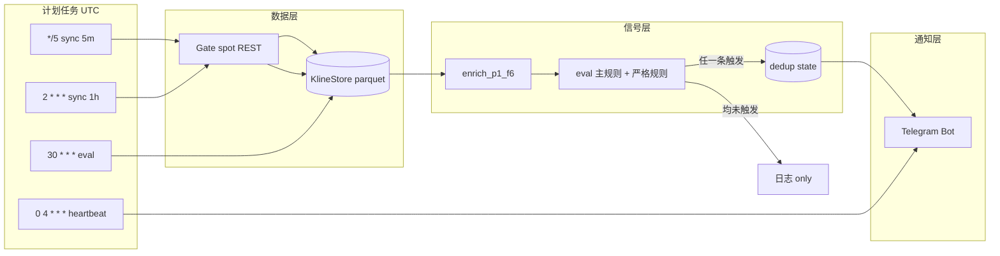

# 实时数据 → p1×f6 信号 → Telegram — 任务计划

> 前置文档：[plan_live_data.md](plan_live_data.md)（阶段 A 已完成占位）

---

## 0. 已确认决策（2026-06）

| # | 项 | 决定 |
|---|-----|------|
| 1 | **数据源** | **Gate spot**，与离线 Gate CSV 一致；增量 REST 写入同一 `KlineStore` |
| 2 | **部署** | **本机** cron / launchd 测试；目标 **连续 20 天不停机** |
| 3 | **未触发** | 信号小时静默；**每天 04:00 UTC（12:00 北京）** 一条心跳（汇总过去 24h） |
| 4 | **时区展示** | 消息 **双时区**：UTC + **北京时间（UTC+8）** |
| 5 | **规则范围** | 同时推送 **主规则** + **严格规则**（两条独立消息，分别 dedup） |

**推送规则定义**（与回测 `build_p1_f6_hour_predictions` 一致）：

| 代号 | 规则名 | 回测参考 |
|------|--------|----------|
| **主规则** | `p1大阴 & f6阳>=4 & f6收盘强>=67% → 1H涨` | `PRIMARY_HOUR_RULE`，约 84% / ~30 笔·月 |
| **严格规则** | `p1大阴 & f6阳>=4 & f6涨>0.2% & f6收盘强 → 1H涨` | 约 91.5% / ~2.4% 覆盖 |

---

## 1. 目标

| 项 | 说明 |
|----|------|
| **输入** | Gate spot REST 增量 5m / 1H K 线 |
| **触发** | 每小时 **:30 UTC**（第 6 根 5m 收盘后） |
| **输出** | Telegram：主/严格规则信号（触发时）；每日心跳（未触发汇总） |
| **非目标** | 自动下单、Web 面板、多品种（首版仅 BTCUSDT） |

---

## 2. 端到端流水线



**时序（以 10:00–11:00 这根 1H 为例）**

| 时刻 UTC | 北京时间 | 动作 |
|----------|----------|------|
| 10:00–10:25 | 18:00–18:25 | 5m 任务持续写入当前小时前 5 根 |
| 10:30 | 18:30 | 5m 写入第 6 根；评估主规则 + 严格规则 |
| 10:30 | 18:30 | to 11:00 | 18:30 | 触发则各发一条 Telegram（可能 0/1/2 条） |
| 11:02 | 19:02 | 1H 任务拉取 10:00–11:00 已收盘 K 线 |
| 04:00 | 12:00 | **每日心跳**：过去 24h sync/评估统计 |

---

## 3. 前置条件

| # | 项 | 说明 |
|---|-----|------|
| 1 | **网络** | 本机可访问 `api.gateio.ws`（20 天测试期间保持联网） |
| 2 | **Telegram Bot** | [@BotFather](https://t.me/BotFather) 创建 bot → `TELEGRAM_BOT_TOKEN` |
| 3 | **Chat ID** | `TELEGRAM_CHAT_ID` |
| 4 | **历史底稿** | 本地较完整 `BTCUSDT_5m/1h.parquet`（离线 Gate CSV），增量只补新 bar |
| 5 | **时区** | 内部逻辑 **UTC**；对外展示 **UTC + 北京时间** |
| 6 | **本机不休眠** | macOS 测试期关闭睡眠或 `caffeinate`（见 §6） |

---

## 4. 分阶段任务

### 阶段 B：Gate spot 增量拉取（约 2–3 天）

| 任务 | 产出 | 说明 |
|------|------|------|
| B1 | `GateFetcher.fetch_klines()` | `GET /api/v4/spot/candlesticks`，`currency_pair=BTC_USDT` |
| B2 | `KlineStore.merge_append()` | 按 `open_time` 去重、排序、写回 parquet |
| B3 | 拉取后 `audit_klines` | 失败则 Telegram 告警、不覆盖坏数据 |
| B4 | `config/live_sync.yaml` | `source: gate`、`enabled: true` |
| B5 | 本机跑 24h | 确认无漏 bar，为 20 天长跑打底 |

**验收**：连续 24h 后 parquet 最新 `open_time` 与 Gate 一致；`m5_count==12` 小时占比不降。

**数据源说明**：首版 **仅 Gate spot**，不切换 Binance。若 Gate 长期不可用，阶段 F 再评估备选源（需与离线 OHLC 对比校验）。

---

### 阶段 C：:30 实时信号评估 — **进行中（无网 offline mock）**

| 任务 | 产出 | 状态 |
|------|------|------|
| C1 | `signal/evaluator.py` + `build_live_p1_f6_row` | ✅ |
| C2 | `evaluate_live_at()` 主/严格双规则 | ✅ |
| C3 | `STRICT_HOUR_RULE` / `LIVE_PUSH_RULES` | ✅ |
| C4 | `scripts/eval_p1_f6_signal.py` + `--as-of` | ✅ |
| C5 | `signal/dedup.py` | ✅ |
| C6 | 数据不足 → `skip_reason` | ✅ |
| C7a | eval 前 `--sync` 5m | `signal/pipeline.run_pre_eval_sync` ✅（B 启用后真实拉取） |
| C7b | sync/eval 失败 Telegram 告警 | `--telegram` + `format_alert_message` ✅ |
| C7c | 触发信号 Telegram 推送 | `--telegram` + dedup ✅ |

**双规则逻辑**：

- 主规则与严格规则 **独立判断**；同一小时可能：都不触发 / 仅主 / 仅严格 / 两者都触发
- 两者都触发时发 **两条消息**（严格规则标注「高置信」）
- 严格 ⊂ 主规则（严格触发时主规则通常也触发），仍分开发送便于统计

**验收**：历史 parquet 最后一小时 dry-run，字段与 `p1_f6_primary_signals.csv` 一致（除 actual 外）。

---

### 阶段 D：Telegram 通知 — **进行中**

| 任务 | 产出 | 状态 |
|------|------|------|
| D1 | `notify/telegram.py` | ✅ |
| D2 | `notify/format.py` 双时区模板 | ✅ |
| D3 | `format_heartbeat_message()` | ✅ |
| D4 | `config/telegram.yaml` | ✅ |
| D5 | 集成 `eval_p1_f6_signal.py --telegram` | ✅ |
| D6 | `scripts/send_daily_heartbeat.py` | ✅ |
| D7 | sync / eval 异常告警 | ✅ |
| D8 | `dry_run`（config 或缺 token） | ✅ |

**验收**：dry-run 双时区格式正确；测试消息 + 一次真实触发（主/严格各测）。

---

### 阶段 E：本机部署 — **已提供脚本**

| 任务 | 产出 | 状态 |
|------|------|------|
| E1 | `logs/` | ✅ |
| E2 | `scripts/install_launchd.sh` + `uninstall_launchd.sh` | ✅ |
| E3 | README 不休眠说明 | ✅ |
| E4 | `scripts/check_live_health.py` | ✅ |
| E5 | 20 天验收 | 安装后计时 |
| E6 | README「本机部署」 | ✅ |

---

### 阶段 F：增强（可选，后续）

| 任务 | 说明 |
|------|------|
| F1 | 5m WebSocket 降低 :30 延迟 |
| F2 | 上一小时信号 actual 回填 + 每周 Telegram 小结 |
| F3 | Telegram inline 按钮 |
| F4 | 备选数据源（仅 Gate 长期故障时） |

---

## 5. Telegram 消息模板

**时间格式约定**：每条含时间戳均写 `UTC` 与 `北京时间` 两行。

**主规则触发：**

```
🟢 BTCUSDT p1×f6 · 主规则

规则: p1大阴 & f6阳>=4 & f6收盘强≥67%
预测: 涨（做多）
────────────────
1H 开盘
  UTC: 2026-06-25 10:00
  北京: 2026-06-25 18:00
入场 (:30)
  UTC: 2026-06-25 10:30
  北京: 2026-06-25 18:30
价格: 67890.12
出场 (1H 收盘)
  UTC: 2026-06-25 11:00
  北京: 2026-06-25 19:00
────────────────
p1: 大阴线 | f6阳: 5 | f6收盘强度: 82%
⚠️ 非投资建议 · 回测约 84%
```

**严格规则触发：**

```
🟢 BTCUSDT p1×f6 · 严格规则

规则: p1大阴 & f6阳>=4 & f6涨>0.2% & f6收盘强
预测: 涨（做多）
…（时间块同上，双时区）…
p1: 大阴线 | f6阳: 5 | f6涨: 0.35% | f6收盘强度: 82%
⚠️ 非投资建议 · 回测约 91% · 覆盖较低
```

**每日心跳（04:00 UTC = 12:00 北京）：**

```
💓 bnb-quant-v2 日心跳

统计区间: 过去 24h
  UTC: 2026-06-24 04:00 – 2026-06-25 04:00
  北京: 2026-06-24 12:00 – 2026-06-25 12:00
────────────────
5m sync: 288/288 成功
1h sync: 24/24 成功
:30 评估: 24 次
信号: 主规则 1 次 · 严格规则 0 次
最新 K 线: 5m 2026-06-25 00:25 UTC (08:25 北京)
状态: ✅ 正常
```

**系统告警：**

```
⚠️ bnb-quant-v2 告警
sync 5m 失败: timeout
UTC: 2026-06-25 10:05
北京: 2026-06-25 18:05
```

---

## 6. 计划任务（UTC · 本机）

```cron
# CRON_ROOT=/Users/void/Documents/BNBWork/bnb-quant-v2
# PY=$CRON_ROOT/.venv/bin/python

# 5m 增量（错开整点 1 分钟）
1,6,11,16,21,26,31,36,41,46,51,56 * * * *  cd $CRON_ROOT && PYTHONPATH=src $PY scripts/sync_live_klines.py --interval 5m --execute >> logs/sync_5m.log 2>&1

# 1H 增量
2 * * * *  cd $CRON_ROOT && PYTHONPATH=src $PY scripts/sync_live_klines.py --interval 1h --execute >> logs/sync_1h.log 2>&1

# :30 信号 + Telegram（主规则 + 严格规则）
30 * * * *  cd $CRON_ROOT && PYTHONPATH=src $PY scripts/eval_p1_f6_signal.py >> logs/signal.log 2>&1

# 每日心跳（04:00 UTC = 12:00 北京时间）
0 4 * * *  cd $CRON_ROOT && PYTHONPATH=src $PY scripts/send_daily_heartbeat.py >> logs/heartbeat.log 2>&1
```

**:30 任务内部顺序：**

1. `sync_live_klines --interval 5m --execute`
2. `evaluate_live_rules()` → 主规则 + 严格规则
3. 各规则独立 dedup → `telegram.send`（0–2 条）

**macOS 20 天不休眠（测试期）：**

```bash
# 方式 A：系统设置 → 电池 → 防止自动睡眠（接电源）
# 方式 B：单独终端常驻
caffeinate -dims &
```

**launchd**：将上述四条转为 `~/Library/LaunchAgents/com.bnbquant.*.plist`，`KeepAlive` + `RunAtLoad` 便于崩溃自启。

---

## 7. 代码结构

```
bnb-quant-v2/
├── config/
│   ├── live_sync.yaml          # source: gate, enabled: true
│   └── telegram.yaml
├── src/bnb_quant_v2/
│   ├── data/live/
│   ├── signal/
│   │   ├── evaluator.py
│   │   └── dedup.py            # key: hour_open_time + rule_name
│   └── notify/
│       ├── telegram.py
│       └── format.py           # 双时区 + 主/严格/心跳模板
├── scripts/
│   ├── sync_live_klines.py
│   ├── eval_p1_f6_signal.py
│   └── send_daily_heartbeat.py
├── data/live/
│   ├── signal_state.json
│   ├── heartbeat_state.json
│   └── latest_signal.json
└── logs/
```

---

## 8. 配置与环境变量

### 8.1 启用真实 Telegram 推送

默认 **`config/telegram.yaml`** 为 `enabled: false`、`dry_run: true`（只模拟、不调 API）。要**真发消息**，按下面三步：

**① 创建 Bot 并获取 Chat ID**

1. 在 Telegram 找 [@BotFather](https://t.me/BotFather)，创建 bot，拿到 `BOT_TOKEN`
2. 私聊或拉 bot 进群组，获取 `CHAT_ID`（私聊可用 [@userinfobot](https://t.me/userinfobot)；群组 ID 通常为负数）

**② 填写 `.env`（项目根目录，勿提交 git）**

```bash
cp .env.example .env
# 编辑 .env：
TELEGRAM_BOT_TOKEN=123456789:ABCdefGHI...
TELEGRAM_CHAT_ID=-100xxxxxxxxxx
```

**③ 修改 `config/telegram.yaml`**

```yaml
enabled: true    # 开启通知
dry_run: false   # 关闭模拟，真实调用 Bot API
```

其余项保持默认即可（`send_on_signal` / `send_on_error` / `send_daily_heartbeat` 均为 `true`）。

**验证**

```bash
# 0) 连通性测试（推荐第一步）
PYTHONPATH=src python3 scripts/test_telegram.py --live

# 1) 仍走 dry-run（不调 API，看消息格式）
PYTHONPATH=src python3 scripts/eval_p1_f6_signal.py \
  --as-of 2023-01-01T14:30:00+00:00 \
  --hour-open 2023-01-01T14:00:00+00:00 \
  --telegram

# 2) 真发心跳
PYTHONPATH=src python3 scripts/send_daily_heartbeat.py

# 3) 上线 :30 任务（需改 yaml 或 eval 加 --telegram）
PYTHONPATH=src python3 scripts/eval_p1_f6_signal.py \
  --sync --telegram --mark-sent
```

> **`test_telegram.py --live`** 会自动读 `.env`，并临时设 `enabled=true`、`dry_run=false`，**无需先改 yaml**。

> **注意**：`.env` 不入库；若只改 yaml 未填 token，程序仍会因缺凭证而无法发送。开发/回放阶段可保持 `dry_run: true`。

---

### 8.2 配置文件参考

```yaml
# config/live_sync.yaml
symbol: BTCUSDT
intervals: [5m, 1h]
source: gate          # 固定 Gate spot
enabled: false        # 阶段 B 完成后改 true
lookback_bars:
  5m: 24
  1h: 3
store_dir: data/klines
```

```yaml
# config/telegram.yaml
enabled: false        # 真发时改为 true
dry_run: true         # 真发时改为 false
parse_mode: HTML
send_on_signal: true
send_on_error: true
send_daily_heartbeat: true
heartbeat_cron_utc: "0 4 * * *"   # 12:00 北京时间
```

```bash
# .env
TELEGRAM_BOT_TOKEN=...
TELEGRAM_CHAT_ID=...
GATE_API_KEY=          # 公开 K 线可留空
```

---

## 9. 风险与对策（本机 20 天）

| 风险 | 对策 |
|------|------|
| Gate API 限频 / 超时 | 重试 3 次 + 指数退避；Telegram 告警 |
| macOS 睡眠导致 cron 漏跑 | 关闭睡眠 / `caffeinate`；launchd `StartCalendarInterval` |
| 本机重启 | launchd `RunAtLoad`；启动后 `check_live_health` |
| :30 第 6 根 5m 未入库 | eval 前强制 sync；缺 bar 则告警 |
| 重复推送 | dedup `(hour_open_time, rule_name)` |
| 主+严格同小时双推 | 设计如此；heartbeat 汇总分别计数 |
| 20 天日志撑满磁盘 | logrotate 或按日切分 `logs/sync_5m.YYYYMMDD.log` |
| 密钥泄露 | `.env` 不入库 |

---

## 10. 实施顺序与工期

| 顺序 | 阶段 | 工期 | 阻塞 |
|------|------|------|------|
| 1 | **C** 双规则评估 | 1–2 天 | **无**（可用 offline mock） |
| 2 | **D** Telegram + 心跳 | 1 天 | Bot Token |
| 3 | **E** 本机 launchd | 1 天 | C+D |
| 4 | **B** Gate 增量 | 2–3 天 | 本机可访问 Gate（可后移） |
| — | **20 天长跑** | 20 天 | B 联调 + E |

**开发合计约 5–7 工作日** + **20 天连续运行验收**。

---

## 10.1 无 Gate 网络时的并行方案

> **现状**：本机暂无法访问 Gate 实时 API，阶段 B 联调与 M1/M4 受阻。  
> **结论**：**开发可继续，仅「真实增量 + 20 天长跑」延后。**

### 被阻塞项

| 项 | 说明 |
|----|------|
| **M1 数据通** | 无法验收 `--execute` 增量写入 |
| **M4 20 天长跑** | sync 任务无法拉取真实 K 线 |
| **端到端 :30** | 无法保证 parquet 与交易所同步 |

### 可并行推进（不依赖 Gate）

| 阶段 | 工作 | 验证方式 |
|------|------|----------|
| **C 信号评估** | `evaluator.py`、主/严格双规则、dedup | 本地 parquet **`--as-of` 回放** / 合成数据 |
| **D Telegram** | Bot、双时区模板、04:00 心跳 | `--dry-run` + 测试消息 |
| **E 部署骨架** | launchd/cron、日志、健康检查 | 先跑 eval/heartbeat；**sync 任务禁用** |
| **B 代码** | `GateFetcher`、`merge_append` | **mock HTTP** 单测，有网后半天联调 |

### 建议节奏

```
现在（无 Gate）
  ├─ C + D + E 骨架  →  M2、M3 可先过（离线/mock）
  ├─ B 代码 + 单测   →  写好待联调
  └─ 20 天长跑       →  暂缓；或仅演练 eval+Telegram（数据不更新）

网络恢复后
  └─ B 联调 → M1 → 启用 sync cron → M4 20 天
```

**工期影响**：B 的 2–3 天拆为「先写代码/mock（现在）」+「联调半天（有网后）」；**真正延后的是 M4，不是全部任务。**

---

## 11. 里程碑验收

| 里程碑 | 标准 |
|--------|------|
| M1 数据通 | Gate `--execute` 更新 parquet，audit 通过 |
| M2 信号通 | dry-run 主/严格规则与回测逻辑一致 |
| M3 通知通 | 测试消息 + 真实触发 + 一条心跳 |
| M4 **20 天长跑** | 连续 20 天：无静默失败、无重复推送、心跳 20/20、5m sync ≥99% |

---

## 12. 下一步

**当前（无 Gate 网络）**：阶段 **C** 进行中 — 离线 parquet + `--as-of` 回放。

网络恢复后：

1. **阶段 B** — `GateFetcher.fetch_klines()` 联调
2. 启用 sync cron → **M4** 20 天长跑

并行：Telegram Bot Token 与 `.env`（阶段 D）。

---

*文档版本：v2.2 · 状态：阶段 E 脚本就绪；M3 已验收；待 B + 20 天长跑*
